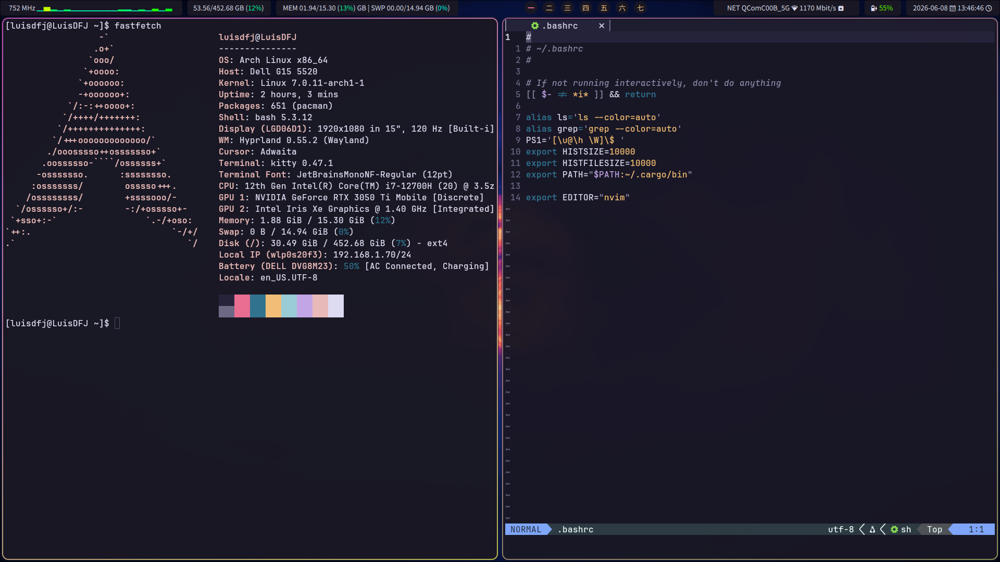

# DOTFILES
This repo contains my Arch + Hyprland + Nvim + Quickshell + Yazi + Kitty setup. Feel free to use any of scripts and config files here. I'm still working on documenting most of the stuff I have gathered. For now I also include some documentation on my [Arch Linux Installation Guide](docs/ArchInstall.md) (I used a LUKS encrypted root partition and use an external USB drive for unlocking it, the procedure is not that hard, but someone might find useful to have an additional rosource other than the official documentation).

